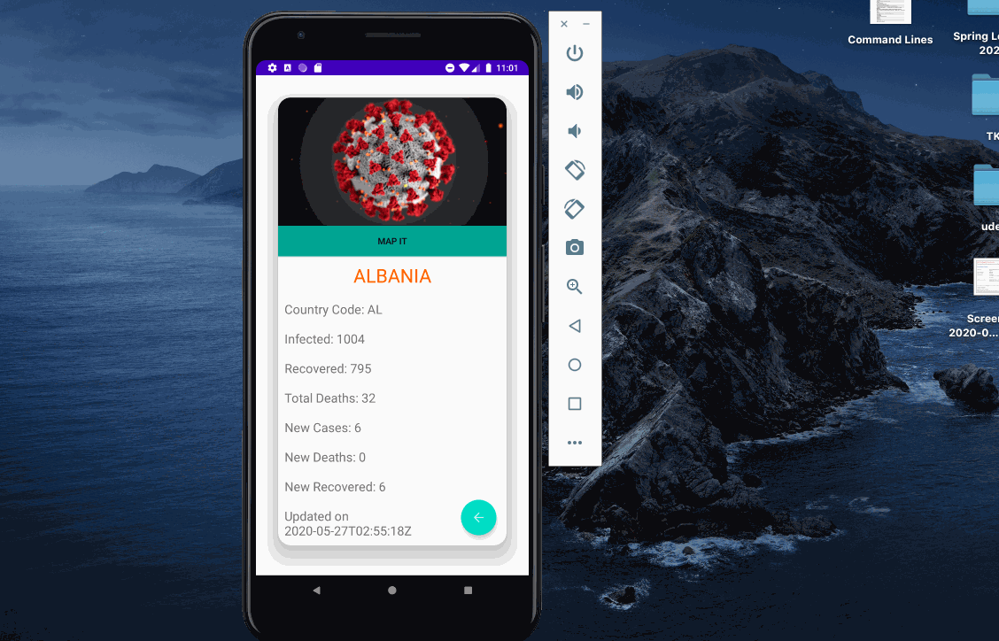

# CovidConnect Application 

---
 
### `Concepts applied into this project`
<ul>
  <li>RecyclerView</li>
  <li>GridLayoutManager</li>
  <li>ViewHolders</li>
  <li>CardLayout</li>
  <li>Broadcast</li>
  <li>Explicit and Implicit Intents</li>
  <li>Menu, Settings</li>
  <li>External API</li>
  <li>Multiple layouts</li>
 </ul>

 
 ### `Challenges`
 <ul>
  <li>The onSaveInstanceState method could not be applied properly throughout the entire application.</li>
  
 </ul>

---

---

---

---

