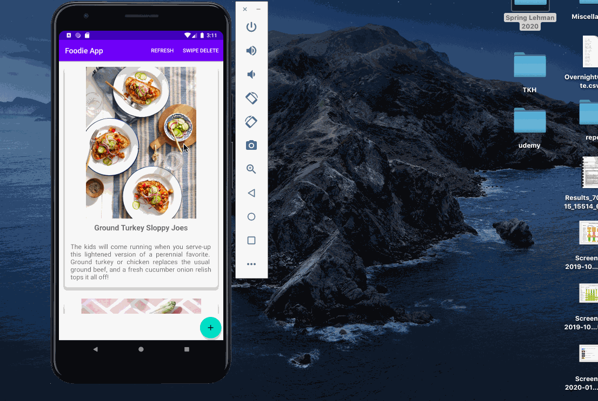

# Specifications
<ul>
  
  <li>Display removable items in a RecyclerView with the opportunity to click on a item</li>
  <li>and be brought to a new activity that displays more details about the item clicked.</li>
  <li>Be able to remove the item</li>
  <li>Be able to provide different layouts for devices and screen sizes</li>
  
 </ul>
 
### `New Concepts`
<ul>
  <li>RecyclerView</li>
  <li>GridLayoutManager</li>
  <li>ViewHolders</li>
  <li>CardView</li>
  <li>Broadcast</li>
 </ul>

 
 ### `Challenges`
 <ul>
  <li>The concept of the Broadcast into the app is not properly implemented which it is not working.<li>
  
 </ul>

---

---

---

---

---
