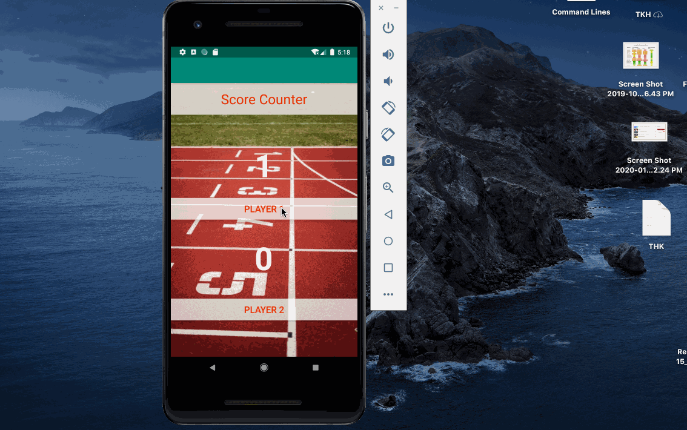
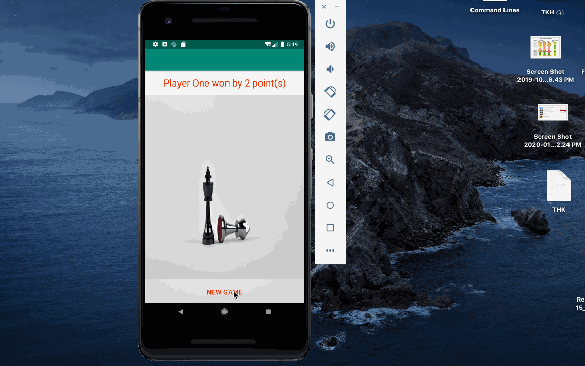

# Specifications

## Create a Score Counter App that displays the winner in a second Activity
<ul>
  <li>Use an image as a background</li>
  <li>Two Teams, each with score of 0 initially</li>
  <li>Each team has a button, when the user clicks to increment the score</li>
  <li>Show the updated score for the appropriate team</li>
  <li>Winner score is 5</li>
  <li>The second activity will display the name of the winner and number of points that winner won by along with an image</li>
 </ul>
 
 ## `Challenges`
 <ul>
  <li>Understanding how the onRestoreInstanceState works</li>
  <li>transferring data to the second activity as an Intent</li>
 </ul>
 
 ---
 
 
 
 ---
 
 

