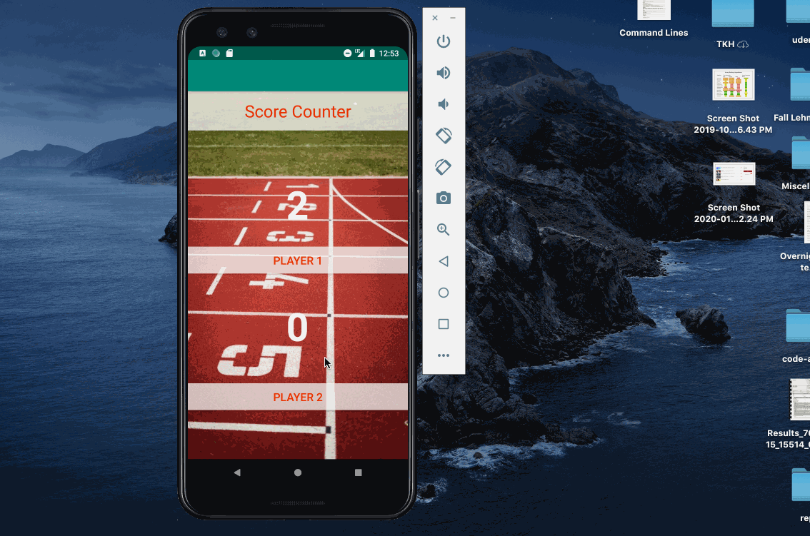
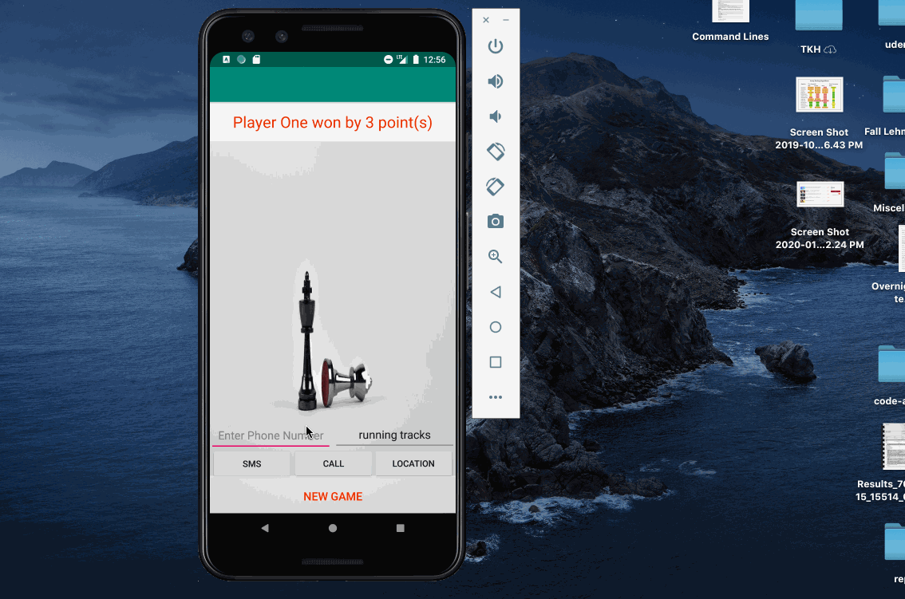
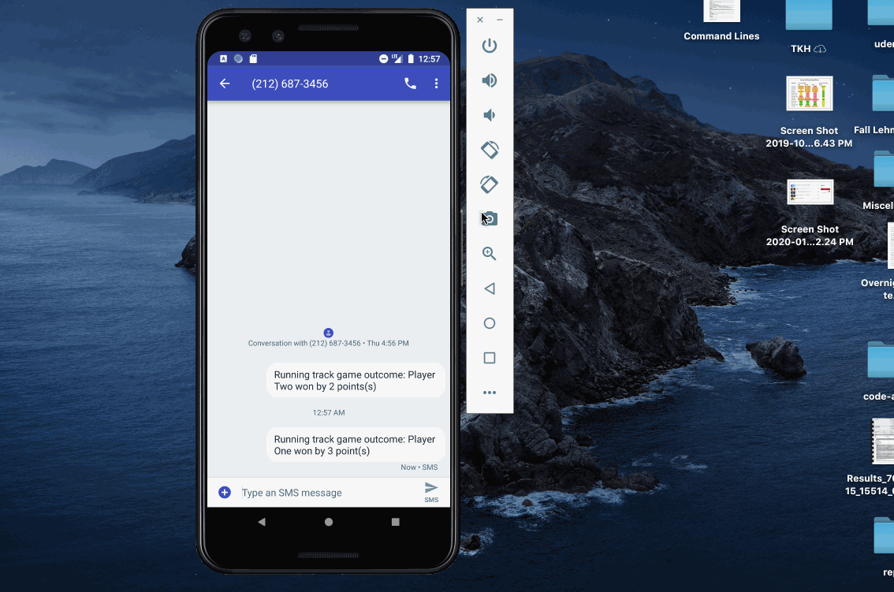

# Specifications
<ul>
  <li>Allows the user to share the winner by implicit intent</li>
 </ul>
 
### `The user should be able to:`
<ul>
  <li>Call a friend.</li>
  <li>Send a text message with the champion and points the champion won by.</li>
  <li>Search on maps for the nearest arena for the sport the app supports.</li>
 </ul>
 
 ### `Challenges`
 <ul>
  <li>Using the implicit intent to transfer information from one activity to another</li>
 </ul>

---

---

