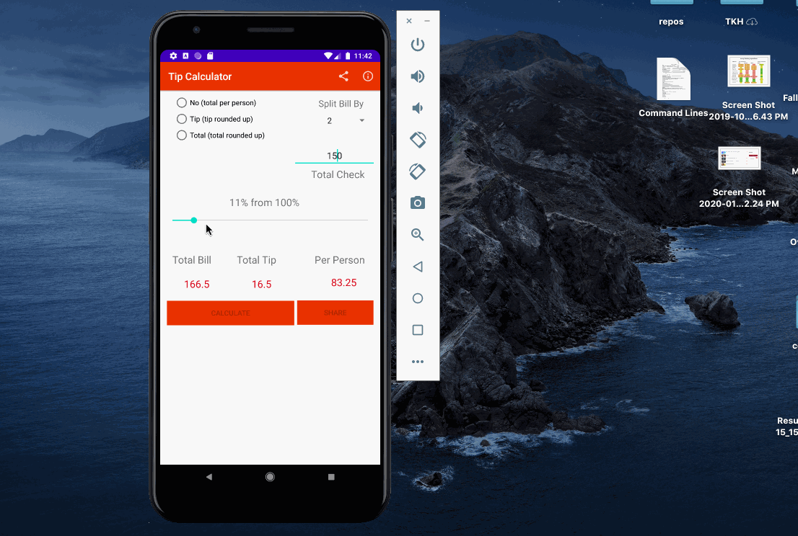

# Specifications
<ul>
  
  <li>A spinner to select the number of people, 1 as the default value</li>
  <li>Radio button to select</li>
  <li>TextView to display per_person_total calculated</li>
  <li>Options Menu app bar</li>
  <li></li>
 </ul>
 
### `Radio Buttons Options`
<ul>
  <li>No "the exact bill"</li>
  <li>Tip "tip will be rounded up"</li>
  <li>Total "total will be rounded up"</li>
 </ul>

 ### `Options Menu with 2 options`
<ul>
  <li>Share: sends a text message containing bill, tip, total and per person</li>
  <li>Info: displays a dialog explaining the spinner is used to split the total among friends</li>
 </ul>
 
 ### `Challenges`
 <ul>
  <li>Spinner and App Bar<li>
  <li>Broke the code into peaces from the practice in the class room and started playing with it until I understood it. </li>
 </ul>

---

---

---

