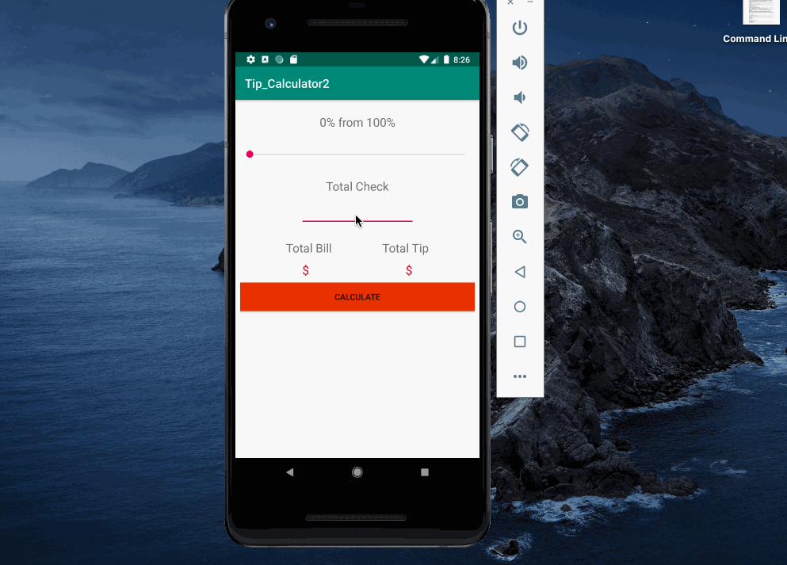
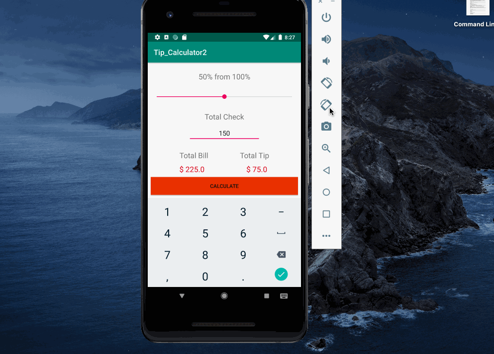

# Specifications
<ul>
  <li>TipCalculator that allows the user to enter the bill amount via the virtual keyboard and then use the SeelBar to drag the Tip percentage and find out what the tip should be and the total.</li>
 </ul>
 
### `App uses the following widgets`
<ul>
  <li>EditText</li>
  <li>SeekBar</li>
  <li>TextView</li>
 </ul>
 
 ### `Challenges`
 <ul>
  <li>First app, so everything was a challenge</li>
  <li>Most challenging was how to get a value from the seekbar</li>
 </ul>
 
 ---
 
 
 
 ---
 
 
